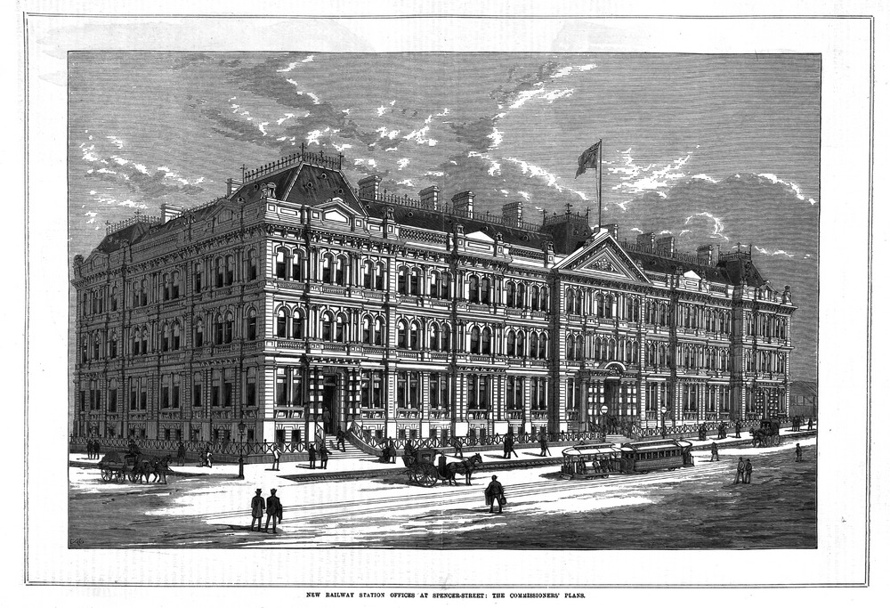
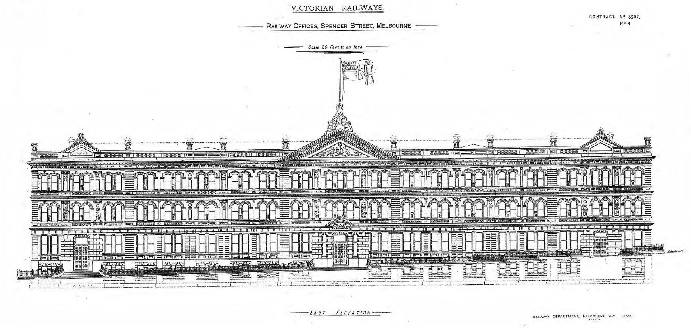
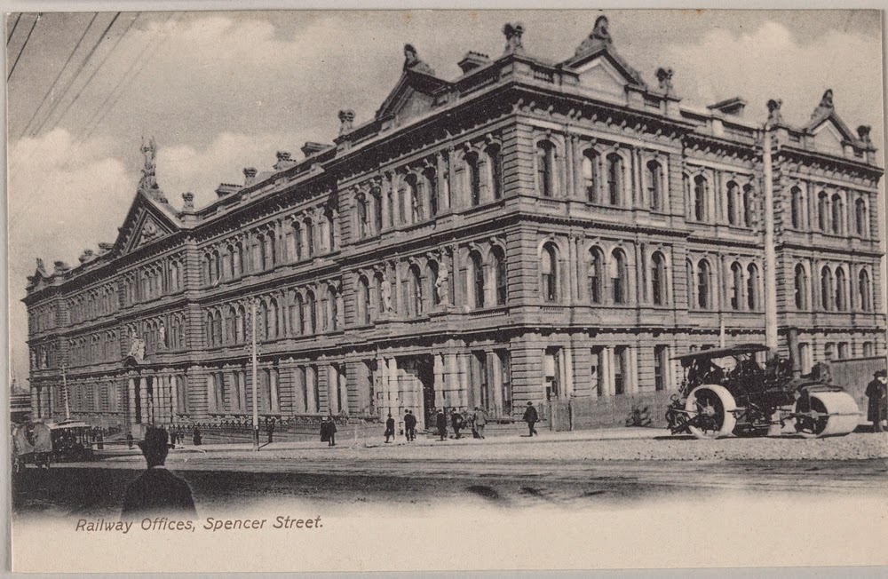
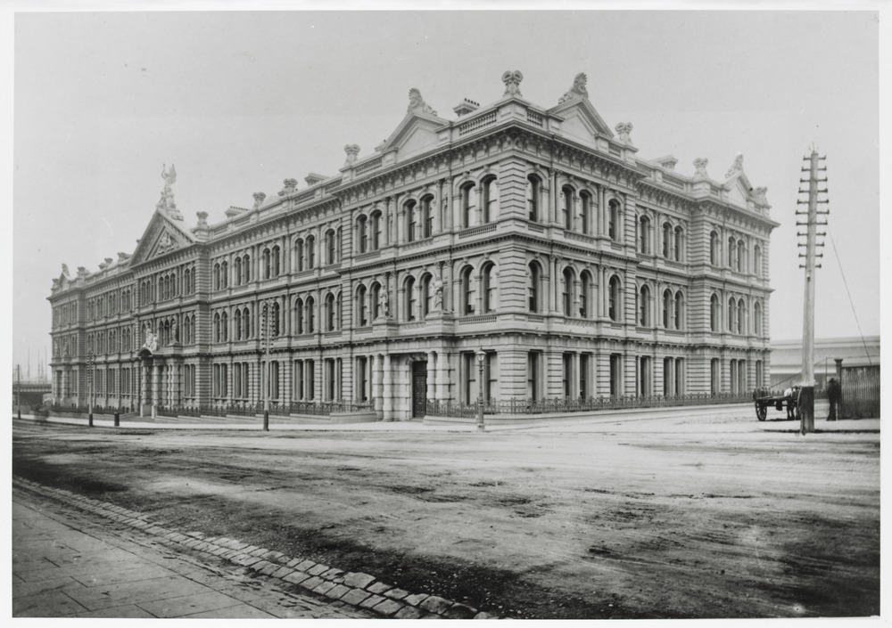

+++
title = "History of the site"
description = ""
weight = 1
+++

53-71C Spencer Street is the former head offices of the Victorian Railways, on Spencer Street, Melbourne, Australia. Today it is used as a hotel, restaurant and apartments. The Renaissance Revival style building is one of the major Victorian era buildings in Melbourne and listed on the Victorian Heritage Register.

The building was opened in 1893 and was the largest office building in the city, reflecting the size of the Railways and the 'boom' of the 1880s. In 1886, the Victorian Railway Commissioners, considering their existing timber offices were inadequate, determined to erect a building that would provide a central location for various branch offices in the city. Designs were prepared by James Moore formerly of the Melbourne & Hobson's Bay Railway Company, and a contract was signed in September 1888. Funds to £25,000 were allocated in the Loan Act of 1887 for the building, with subsequent allocations taking the total to £132,000 including furnishings. Originally to be built of bluestone, due to high cost brickwork with stucco was used instead.

The building is of a shallow U shape, with a 420 feet (130 m) frontage onto Spencer Street. The siting was such that the building would not interfere with the Flinders Street Viaduct, which was yet to be built. The building is symmetrical in plan, with the Spencer Street facade divided into five bays. The central bay projects slightly, incorporating the main entrance with heavy banded rustication, and led into the main staircase, 50 ft by 60 ft (15.25 m by 18.28 m) and lit by three windows with the 'VR' insignia.

Secondary entrances at each end of the building, and a central corridor ran the whole length of the building and wings. Originally consisting of a basement and three floors, the fourth floor was added in 1912, changing the skyline from one dominated by large pediments, finials and statuary above the main entrance to one dominated by a pair of distinctively Edwardian domes flanking an arched windows on the centre. A further attic floor was added in 1922. A number of statues graced the top of the building, but were removed in 1930 when they began to break up and were considered a danger to the passing public. By 1925 the VR magazine reported that the building was overcrowded, with some departments moved to the Newport Workshops.

By the 1980s the Victorian Railways had broken up into the Ministry of Transport, the Metropolitan Transit Authority, and the State Transport Authority. In 1985 Transport House at 589 Collins Street was acquired and 67 Spencer Street was vacated. The Victorian Government sold the building by tender in 1988 for $5.2 million, to a development company and a Japanese financier who proposed a 217-room hotel and 158 car parks, but the deal fell through when the Japanese financier pulled out.

In 1989 Melbourne's Greek community offered to buy the building for $7.9 million, but again the contract fell through. The mortgage owner put the building to auction in September 1990 but no sale was made. The building was originally sold in March 1993 for A$2.5 million for conversion to residential apartments. It was not until October 1997 that the redevelopment completed into 240 apartments, half forming the All Seasons Grand Hotel. As well as restoring the building, a swimming pool and multilevel car park was built at the rear of the building.

This text modified and updated from Wikipedia contributors. (2019, December 8) Wikipedia, The Free Encyclopedia. Retrieved 02:04, June 6, 2020, from [67 Spencer Street](https://en.wikipedia.org/w/index.php?title=67_Spencer_Street)
<!--
## More resources: 

#### Photos of the building  from the State Library's collection

img img img img

#### Heritage resources

* National Trust
* Heritage Victoria
-->
#### Image credits

1.  Image in private collection, used with permission
2.  Image in private collection, used with permission
3.  Image in private collection, used with permission
4.  Image in private collection, used with permission
